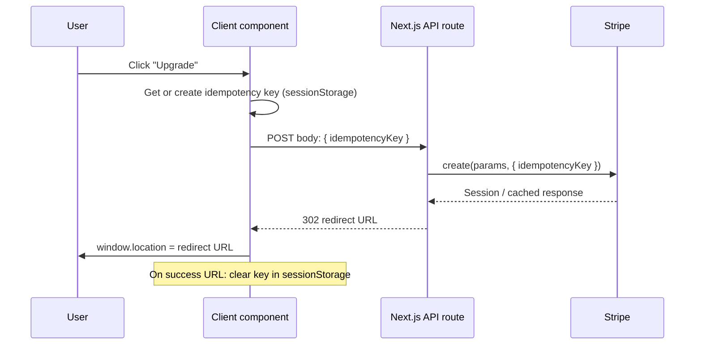

# Idempotency keys for Stripe (ideal scenario)

## Current behavior and risk

- [PlanCardsSection.tsx](app/app/upgrade/PlanCardsSection.tsx) uses plain `<form method="POST" action={url}>` for "Upgrade to Pro", "Manage subscription", and "Cancel subscription".
- No loading state: double-clicks or retries can fire multiple POSTs. Each Stripe call creates a new resource (checkout session, portal session) or repeats the same update.
- Stripe supports an **idempotency key** so that retries with the same key return the same result instead of creating duplicates.

## Target behavior

- One idempotency key per logical “intent” (one checkout attempt, one portal attempt, one cancel attempt).
- Retries (same intent) send the **same** key so Stripe returns the cached response.
- After success (redirect to Stripe or success page), clear the key so the next click is a new intent.

## Architecture

## Implementation plan

### 1. API routes: accept and forward idempotency key

**Files:** [app/api/stripe/create-checkout-session/route.ts](app/api/stripe/create-checkout-session/route.ts), [app/api/stripe/create-portal-session/route.ts](app/api/stripe/create-portal-session/route.ts), [app/api/stripe/cancel-subscription/route.ts](app/api/stripe/cancel-subscription/route.ts)

- Parse the key from the request:
  - Prefer JSON body: `await request.json()` and read `idempotencyKey` (or `idempotency_key` for consistency with form-style).
  - If the client sends form data, use `request.formData()` and get the same field.
- If a key is present, pass it to Stripe as the second argument:
  - **Checkout:** `stripe.checkout.sessions.create(sessionParams, { idempotencyKey: key })`
  - **Portal:** `stripe.billingPortal.sessions.create({ ... }, { idempotencyKey: key })`
  - **Cancel:** `stripe.subscriptions.update(subId, { cancel_at_period_end: true }, { idempotencyKey: key })`
- If no key is provided, call Stripe without the option (backward compatible with existing form POSTs).

Validation: key should be a non-empty string (e.g. max 255 chars per Stripe); if invalid, ignore it and proceed without idempotency.

### 2. Client: generate key, send with request, clear on success

**New client component** (e.g. `StripeActionButton` or `StripeForm.tsx`) used only for the three Stripe actions:

- **Props:** `action: "checkout" | "portal" | "cancel"`, `url: string`, `children` (button label), optional `variant`/`className` for the button.
- **sessionStorage key:** e.g. `stripe_idempotency_${action}` so each action type has its own key.
- **On click (or submit):**
  1. Get or create key: `sessionStorage.getItem(...)` or `crypto.randomUUID()` then `sessionStorage.setItem(...)`.
  2. Disable the button (loading state) to reduce double-clicks.
  3. `fetch(url, { method: "POST", headers: { "Content-Type": "application/json" }, body: JSON.stringify({ idempotencyKey: key }) })` with `redirect: "manual"` so you can read the `Location` header.
  4. If response status is 302/303, set `window.location.href = response.headers.get("Location")`. Before redirecting, clear the idempotency key for this action if the `Location` is a success URL (e.g. Stripe host or `routes.upgrade?success=true` or `?canceled=true`), so the next attempt gets a new key.
  5. On error (non-redirect response or network failure), show a short message and re-enable the button; keep the key in sessionStorage so retry uses the same key.
- **Optional:** On redirect to `...?error=...`, keep the key so "Try again" uses the same idempotency key.

**Integration in** [PlanCardsSection.tsx](app/app/upgrade/PlanCardsSection.tsx):

- Replace the three `<form action={...} method="POST">` blocks with the new client component:
  - Upgrade to Pro: `<StripeActionButton action="checkout" url={STRIPE_CHECKOUT_URL}>Upgrade to Pro</StripeActionButton>`
  - Manage subscription: `<StripeActionButton action="portal" url={STRIPE_PORTAL_URL}>Manage subscription</StripeActionButton>`
  - Cancel subscription: `<StripeActionButton action="cancel" url={STRIPE_CANCEL_SUBSCRIPTION_URL} variant="ghost">Cancel subscription</StripeActionButton>`
- Pass through any existing styling (e.g. `className`, `variant`) so the layout and appearance stay the same.
- PlanCardsSection remains a server component; it only imports and renders the new client component with the same URLs and labels.

### 3. Key lifecycle and edge cases

- **When to clear the key:** When the user is sent to Stripe Checkout/Portal (redirect URL is Stripe) or to your upgrade page with `?success=true` or `?canceled=true`. That way the next "Upgrade" or "Manage" is a new intent with a new key.
- **When to keep the key:** On error redirect (`?error=...`) or on fetch failure, so a retry reuses the key and Stripe returns the same session if one was already created.
- **Stripe key TTL:** Stripe stores idempotency for about 24 hours; no change needed on your side.

### 4. Backward compatibility

- Existing direct form POSTs (e.g. from bookmarks or old HTML) do not send a key; the API continues to call Stripe without `idempotencyKey`, so behavior is unchanged.
- No change to webhooks or to the upgrade page’s success/error handling beyond the new client component controlling redirects and clearing keys.

## Files to add or change

| File                                                                                               | Change                                                                                                                   |
| -------------------------------------------------------------------------------------------------- | ------------------------------------------------------------------------------------------------------------------------ |
| [app/api/stripe/create-checkout-session/route.ts](app/api/stripe/create-checkout-session/route.ts) | Parse `idempotencyKey` from body; pass to `stripe.checkout.sessions.create(..., { idempotencyKey })`.                    |
| [app/api/stripe/create-portal-session/route.ts](app/api/stripe/create-portal-session/route.ts)     | Same for `stripe.billingPortal.sessions.create`.                                                                         |
| [app/api/stripe/cancel-subscription/route.ts](app/api/stripe/cancel-subscription/route.ts)         | Same for `stripe.subscriptions.update`.                                                                                  |
| **New** `app/app/upgrade/StripeActionButton.tsx` (or similar)                                      | Client component: sessionStorage key per action, fetch with key, redirect handling, loading state, clear key on success. |
| [app/app/upgrade/PlanCardsSection.tsx](app/app/upgrade/PlanCardsSection.tsx)                       | Replace the three Stripe forms with the new client component; keep URLs and labels.                                      |

## Testing (manual)

- Click "Upgrade to Pro" once: should redirect to Checkout; sessionStorage key present during request, cleared after redirect.
- Double-click quickly: only one Checkout session created; second request returns same session (or 302 to same URL) thanks to idempotency key.
- Simulate retry: trigger error (e.g. invalid config), then fix and click again with same key in sessionStorage; Stripe returns cached result if the first request had already created a session.
